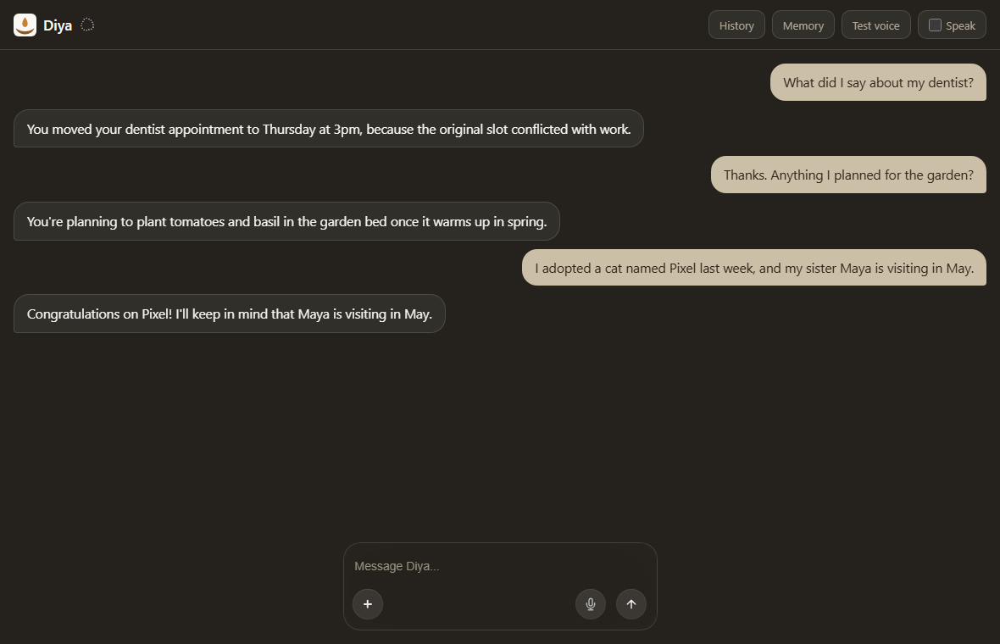
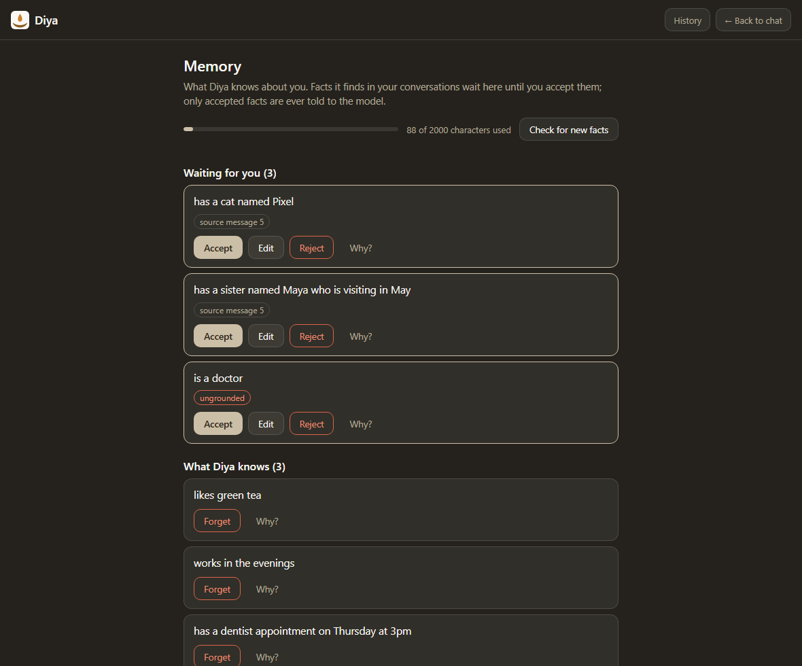

# Diya

Diya is the beginning of a local-first AI appliance: a private assistant that runs entirely on
hardware you own, not a cloud subscription. Today that means the model, your memory, and your
speech all stay on this machine, and facts it learns about you are staged for review before
they're ever trusted.





*Screenshots of the real UI on invented data (`sample_notes/` and made-up facts), taken in headless Edge.*

## Quickstart

Needs Python 3.10+, Node 18.18+ (22.15+ trusts the mkcert certificate on its own, see [docs/lan.md](docs/lan.md)), [Ollama](https://ollama.com) and [mkcert](https://github.com/FiloSottile/mkcert).
Setup note: Diya has only been run on Windows; other systems are untested. Run them from the repo root (the last three in a second terminal):

```bash
ollama pull qwen2.5:3b
ollama pull nomic-embed-text
pip install .                              # every version pinned in pyproject.toml
mkcert -install                            # once per machine
mkcert localhost 127.0.0.1 ::1             # writes localhost+2.pem and localhost+2-key.pem here
python diya_web.py                         # Ollama must be running; first run downloads Whisper and prints an access token once
cd frontend                                # second terminal: the server above keeps running
npm install
npm run dev                                # set DIYA_TOKEN to that token first (below); then open https://localhost:3000
```

The API requires an access token; the UI's server sends it for you. Set `DIYA_TOKEN` to the token the
API printed at first start (PowerShell: `$env:DIYA_TOKEN = "<token>"`; POSIX: `export DIYA_TOKEN=<token>`)
before `npm run dev`, or put `DIYA_TOKEN=<token>` in `frontend/.env.local` (gitignored). Only a hash is
kept, so a lost token can't be shown again: start the API once with `--rotate-token`.
`DIYA_REQUIRE_TOKEN=0` turns the requirement off. Details in [docs/lan.md](docs/lan.md).

`pyproject.toml` pins every direct dependency to an exact version. `requirements.lock` pins the
full dependency tree with hashes; `pip install --require-hashes -r requirements.lock` is the most
reproducible install, proved in a fresh virtualenv against the full test suite. It is resolved for
this project's own platform (Windows, Python 3.13) -- regenerate it for another platform with
`uv pip compile pyproject.toml --extra dev -o requirements.lock --generate-hashes`. Settings are
`DIYA_*` environment variables (see `diya_config.py`). For a terminal chat instead of the UI:
`python diya.py new`.

## Works today

- Chat with eight tools (notes search, web search, weather, reminders, a to-do list, file listing); threads are saved.
- Reminders: say "remind me to call mum tomorrow at 5pm". The time is read in code, a reminder is saved only if you asked for one, and the
  **Reminders** page (the sidebar shows how many are due) shows what is due, with buttons to push one back 10 minutes, an hour or to tomorrow
  morning. An optional desktop notifier (`diya_notify.py`) can tell you outside the app, but only once you schedule it yourself
  ([docs/reminders.md](docs/reminders.md)); nothing here schedules it for you.
  File listing is limited to `Documents/Diya` under your home folder, or the folders in `DIYA_FILES_ROOTS`.
- **Repeating reminders**: say "remind me every Monday at 9am to take out the bins". The repeat is read in code from your own words
  (every day, every weekday, every Monday and Thursday, every month on the 15th, every 2 weeks; no time means 09:00, and Diya says
  so), and each time one falls it becomes an ordinary reminder. The **Scheduled** page lists them, and pauses, resumes, skips the
  next time of, or stops one, with a plain-words record of what happened. A week missed while the computer was off is one
  reminder, not seven. Hourly, "until June", "every second Tuesday" and yearly are refused, not guessed. See
  [Schedule design](docs/SCHEDULE_DESIGN.md).
- A **Today** page: what is due now and later today, the tasks overdue or due today, and the repeating reminders that make one next.
  It is built in code from your own reminders and tasks; no model writes any of it.
- A **to-do list inside Diya**: say "add a task to buy oat milk" and it is saved at once, in Diya's own database, with nothing
  sent anywhere. The **Tasks** page lists what is open (and what is overdue), takes a new one, ticks one off and puts it back.
  A task is saved only if you asked for one, a due date only if you said it, and it is never sent to Todoist unless you name
  Todoist. Diya can add a task and read the list; ticking one off is yours to do. See [Tasks design](docs/TASKS_DESIGN.md).
- Optional connectors on the **Connections** page: Home Assistant, Notion and Todoist, each off until you paste a token there,
  plus Google Calendar (a real Google login, once you set `DIYA_GOOGLE_CLIENT_ID`/`DIYA_GOOGLE_CLIENT_SECRET` from your own
  Google Cloud project -- see [Connectors design](docs/CONNECTORS_DESIGN.md)). They read on their own; the one thing Diya can
  change is a Todoist task you approve (below). Nothing is sent anywhere until you connect it, and disconnecting is instant.
- An **Actions** page (and `python diya_actions_cli.py`) where anything Diya proposes to change outside this computer waits
  for your approval: you press Approve on exactly what is shown, it runs once, and every step is recorded. The one thing it can
  propose is **adding a task to your Todoist Inbox**, and only when you ask for one and name Todoist ("add 'x' to my
  Todoist"; any other "add a task" goes on Diya's own list above), with a due date only if you said one; nothing else Diya
  touches can be changed, and **no real Todoist account has been tried yet**, only the real API's answer to a fake token.
- Hold-to-talk voice input through local Whisper, and optional spoken replies.
- A plain fact ("my flight is Friday at 6") gets a one-line reply, not an essay.
- Facts it extracts wait in a review queue; nothing reaches the model unless you accept it.
  Review them on the **Memory** page of the UI, or with `python diya_review.py list`, `accept`, `reject` and `edit` (see [Dreaming](docs/dreaming.md)); `judge` asks the local model for an optional second opinion.
  The model is told the accepted facts, in every chat; your old `user_profile.txt` was imported once.
- The API listens on localhost only, requires an access token, checks Host and Origin, and rejects an over-size body (413); 4738 tests pass on Windows (as of 2026-10-10).

## Privacy, and where your data is kept

- **Stays on this computer:** the model, the embeddings, speech-to-text (after Whisper's first download), your chats, your memory, reminders and tasks.
- **Leaves, only when it is used:** `web_search` (the words it searches, to DuckDuckGo), `get_weather` (the place, to Open-Meteo), a connector you
  connected, and, once, the download of the Whisper model from Hugging Face.
- **Usage reporting is switched off** in the three libraries that would otherwise send some: ChromaDB (the notes index), Hugging Face (the download) and
  Next.js (the UI's launcher). One thing code cannot decide: spoken replies use the voice your *browser* picks, and some browsers' default voices are
  online services. Leave "Speak replies" off, or pick a local voice, if that matters to you.
- **Where it is kept.** By default, beside the code. If that folder is copied by a cloud-sync program (OneDrive, Dropbox), set `DIYA_DATA_DIR` to a folder
  outside it: one setting moves the database, the access-token hash, Dreaming's state, log and review queue, the notifier's log and the connectors' tokens
  (a file's own `DIYA_*` setting still wins). The folder is made when Diya starts. The TLS certificate pair is separate: `DIYA_SSL_CERT` and `DIYA_SSL_KEY`.
  To move what already exists: `python diya_data.py move --to "$env:LOCALAPPDATA\DiyaData" --certs` (PowerShell). It **copies and checks** (same bytes, same rows in every
  table, the database's integrity checks) and never deletes or overwrites anything, refuses a cloud-sync folder, and ends by printing the settings to apply;
  deleting the originals afterwards is yours to do. `--dry-run` shows the plan first.
- **A passcode for the UI.** `DIYA_UI_PASSCODE` (in the terminal that starts the UI, or in `frontend/.env.local`) puts a sign-in in front of every page and
  call; `npm run dev:lan` refuses to start without one of at least 12 characters, because otherwise anyone on the network could use Diya as you. See
  [UI login design](docs/UI_LOGIN_DESIGN.md) and [LAN mode](docs/lan.md).

## A better model for this laptop (optional)

`qwen2.5:3b` is the default because a plain `ollama pull` is all it needs. On a 16 GB computer `qwen3:4b-instruct` was measured as better (9 of 9 evals in
every run against 7 to 8; it reaches for a tool nobody asked for on 2% of messages against 13%; [model benchmark](docs/MODEL_BENCHMARK.md)), at about 1.4 times
the time per message and 1.7 GB more memory. It needs its context window capped or it fails to load:

```bash
ollama pull qwen3:4b-instruct
ollama create diya-chat -f ollama/diya-chat.Modelfile   # the same weights, capped at 16,384 tokens; nothing more is downloaded
# then set DIYA_MODEL=diya-chat for the API and for the scheduled Dreaming task
```

## Known limits

- Nothing tells you outside the app until you schedule the desktop notifier yourself, and the 3B model sometimes changes the time you gave: the tool refuses a changed time and the model asks again, so a valid
  request is sometimes not saved at first (4 of 27 runs in a small measurement). "Next Friday", a bare "at 5" and "3/4" are refused on purpose.
- Repeating reminders: the repeat is read from your own words when it is part of the request ("remind me every day at 8am to ..."), not from
  what the model passes on, because measured on the 3B model that saved the wrong time (9 of 60) and said a reminder repeated when it did not
  (11 of 60); with the words read in code it was 59 of 60 right, and a repeat Diya refuses (hourly, "until June") was never saved (0 of 27).
  The 20 labelled requests were looked at while building it; on 30 fresh phrasings 29 behaved (the miss, "I need a reminder every morning ...",
  fails safe). A repeat that is part of something else ("I do it every Sunday") or has words after it that could change it ("every day except
  Sunday") is not read, and the model's own version is kept only if it is your words exactly. Tasks do not repeat. See
  [Schedule design](docs/SCHEDULE_DESIGN.md), section 6.
- The optional model check on a staged fact (`python diya_review.py judge`) is the same small model that proposed it, and it was measured only on
  a few dozen invented cases: it says "not supported" to true facts that are only implied, and a message can steer it. It is a hint, never a decision.
- `web_search` is not covered by the outbound-host allowlist that limits `get_weather` to Open-Meteo (`DIYA_TOOL_ALLOWED_HOSTS`).
- Models are pulled by tag, not pinned; the 3B model sometimes calls tools it should not. For adding a task it reached for the tool
  unasked on 16% of messages (24 of 153 in a measured run, `python diya_actions_bench.py`), and a guard in code refused every one
  (0 of 153 saved). The guard knows a short list of ways of asking, so an unusual phrasing ("jot it down as a task") is refused and
  you can say it again. The model's words are another matter: after a refusal it still told the person it had added a task in about
  2% of those messages (3 of 153, found by a rough pattern match; the list itself was right). The "Todoist" rule is a word, not an
  understanding: "add a task to update my Todoist password" goes to Todoist (a card to approve, or a refusal that says why).

## Docs

- [LAN mode and certificates](docs/lan.md): use Diya from a phone, and the mkcert details.
- [Dreaming](docs/dreaming.md): how staged memory works, and how to run and schedule it.
- [Roadmap](ROADMAP.md): the Stage 0 checklist and later stages. [Product vision](PRODUCT_VISION.md): the current state.
- [Research](RESEARCH.md): a dated index of market and technical signals, including comparable
  local-memory projects (Truffle, Hindsight) and agent-harness engineering patterns (UFO's
  grant-in-chat audit trail, Dreaming-shaped nightly consolidation showing up independently in
  three unrelated projects) weighed against Diya's own design, not adopted wholesale.
  [Stage 1 design](docs/STAGE1_DESIGN.md): the trust/auth spec (built). [Stage 2 design](docs/STAGE2_DESIGN.md): reviewing and promoting staged facts, so memory the model sees has been read by you (built, including an optional, measured model verifier). [Person-tagged memory](docs/PERSON_MEMORY_DESIGN.md): who a fact is about, built into review, the model's own system message, and the CLI/UI (built). [Model benchmark](docs/MODEL_BENCHMARK.md): three installed models on this laptop, first pass. [Proactivity design](docs/PROACTIVITY_DESIGN.md): reminders that fire, the first step from an assistant that answers to one that tells you (built except the desktop notifier). [Connectors design](docs/CONNECTORS_DESIGN.md): outside accounts as a menu any owner picks from (Home Assistant, Notion, Todoist and Google Calendar all built; the OAuth connector's code is not yet verified against the real Google endpoints). [Actions design](docs/ACTIONS_DESIGN.md): the approval gate and action trail any future write must go through -- the model proposes, code executes, only the owner approves (built: the store and its state machine, the model's side, the Actions page and command line you approve on, and the first real write, adding a Todoist task; every other connector is read-only). [Tasks design](docs/TASKS_DESIGN.md): the to-do list kept inside Diya itself, why that and not an API, and what the model may do with it (built: the list, its two tools, the Tasks page). [Schedule design](docs/SCHEDULE_DESIGN.md): repeating reminders, snooze, a record of what happened, and the Scheduled and Today pages (built, and measured with the real models; the measurement changed the design). [UI design](docs/UI_DESIGN.md): the redesigned interface, a warm-paper light theme and a near-black dark theme, one sidebar, a plain message box, and the measured palette.

## Architecture

```
browser -> Next.js UI (:3000, HTTPS): its /api/* routes forward to the API, holding the token
             -> FastAPI diya_web.py (127.0.0.1:8080, HTTPS)
                  |- diya.py Agent (tool loop) -> Ollama :11434 (qwen2.5:3b, nomic-embed-text)
                  |- diya_db.py -> SQLite diya.db (threads, messages, reminders, tasks)
                  '- faster-whisper (base)
dreaming.py (run separately) reads diya.db -> dream_pending.jsonl
diya_review.py (by hand) or the UI's Memory page reads dream_pending.jsonl -> reviewed facts in diya.db -> the model, if accepted
```

`sample_notes/` holds fictional demo notes, embedded into an in-memory Chroma index at each start.
`milestone*.py` and `archive/` record the first, learning phase. Personal data (`diya.db`,
`user_profile.txt`, `dream_*`, `watcher_*`, `*.pem`) is gitignored.

## Tests and evals

```bash
pip install ".[dev]" && python -m pytest  # about 2 minutes, from the repo root
python diya_evals.py                      # needs Ollama and both models; exits 1 if any case fails
python diya_actions_bench.py --runs 3     # needs Ollama: when does the model add a task, asked and not (about 30 minutes)
```

The tests use a fake model client, temporary directories and a cleared `DIYA_*` environment, so they
cannot reach `diya.db`. The evals send nine prompts to the real model, on a temporary database; one
calls Open-Meteo. Results vary between runs on a 3B model.

## License and credits

All rights reserved: the code is published to read, and no license to use, copy, modify or distribute
it is granted. Third-party parts keep their own licenses (the microphone icon is from the MIT-licensed
[Libraries.dev](https://github.com/Jakubantalik/Libraries.dev); see [notices](THIRD_PARTY_NOTICES.md)).
The project is modeled on a research dossier: `dossier_content.py` is its source; the PDF (`render_pdf.py`) and the web page
(`render_html.py`, standard library only) are both generated from it, and a test fails if the committed page is stale.
