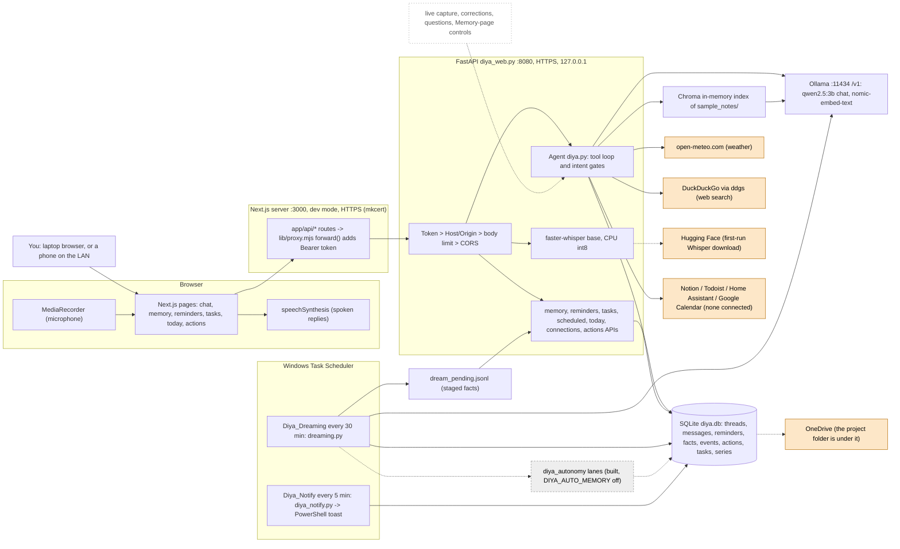
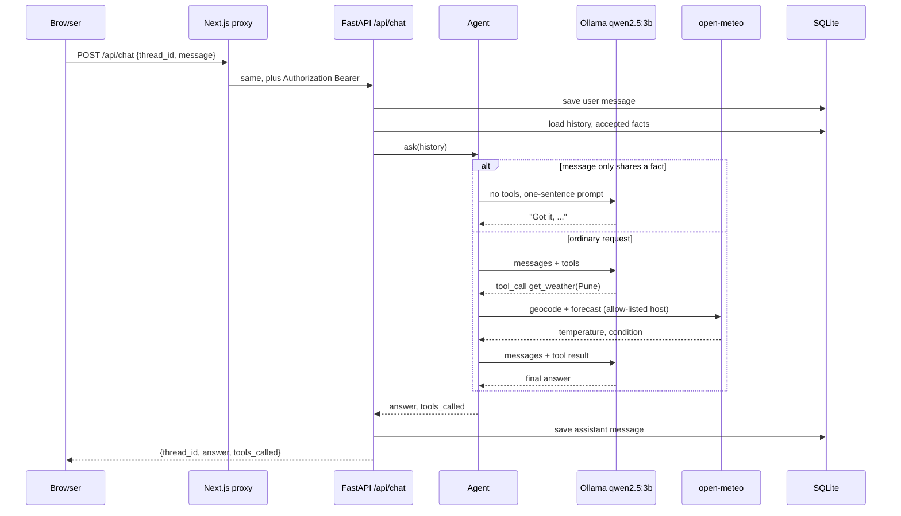

# Diya: an evidence-based audit of the codebase (2026-10-10)

Read-only. Nothing in the product was changed to produce this; this file is the only thing written. It answers the 18-part brief
you pasted, in its order. Every claim says where it comes from: `file:line` for code, `docs/...` for a recorded measurement,
"isolated check" for something I ran today, and "not verified" where I could not or did not establish it.

## 0. How this was done, and what it cannot tell you

**What I did.** Read the code (`diya_web.py`, `diya.py`, `diya_db.py`, `diya_config.py`, `dreaming.py`, `diya_memory.py`,
`diya_autonomy.py`, `diya_actions.py`, `diya_connectors.py`, `diya_notify.py`, the frontend proxy, chat page, voice bar and launcher,
`docs/lan.md`, `README.md`, `PRODUCT_VISION.md`, `docs/MODEL_BENCHMARK.md`). Read-only queries of the machine: `ollama list/ps/show`,
the two scheduled tasks' settings, RAM/GPU/CPU. Read-only counts (no text) from `diya.db`, and counts of lines in the logs.
`pytest --collect-only`. One run of the full suite earlier today (4371 passed, 2 skipped, on this Windows machine). One *isolated check*
(a fake model and a throw-away database in a temp folder, no network, no live data) to settle whether a suspected defect was real.

**What I did not do.** Start the API, the UI, Ollama inference, the microphone or a phone. Contact any service for the audit. Run the
benchmarks. Read the contents of your chats or facts (only counts). Build the frontend. So "works" below means *tests, recorded
measurements, or past real use say it works*, never "I just saw it work".

**Evidence levels used in the tables.**
**T** automated tests with a scripted fake model (pass today) · **M** measured with the real model (`docs/*BENCH*`, `MODEL_BENCHMARK.md`) ·
**L** really used (the live `diya.db` and logs show it) · **I** isolated check today · **C** code reading only.

**Status words** (from your brief): VERIFIED WORKING · IMPLEMENTED, NOT VERIFIED · PARTIALLY IMPLEMENTED · MOCKED OR PLACEHOLDER ·
PLANNED ONLY · BROKEN · UNKNOWN. I added **NOT IMPLEMENTED** for things that are neither built nor planned.

---

## 1. Executive summary

**What it is.** Diya is a one-person, local-first personal assistant for Windows: a Python API (FastAPI) wrapped around a small local
language model (`qwen2.5:3b` through Ollama), with a Next.js web UI, SQLite storage, local speech-to-text (Whisper), a to-do list,
one-off and repeating reminders, a "Today" page, a reviewed long-term memory, optional connectors (Home Assistant, Notion, Todoist,
Google Calendar) and an approval gate for anything that would change something outside the computer.

**What it does today.** It chats, remembers conversations, calls eight tools (notes search, web search, weather, reminders, to-dos,
file listing), saves reminders and tasks only when you ask for them, listens through the browser microphone, and every 30 minutes
a scheduled job (`Diya_Dreaming`) looks for facts in what you said. A second scheduled job (`Diya_Notify`, registered today) is meant
to show a Windows notification when a reminder is due.

**How complete.** The *mechanisms* are unusually well tested for a one-person project (4,373 tests, mutation testing of the newer
modules, written design docs before code). The *product* is much less proven: the live database holds chats only from 2026-09-16
to 2026-09-23 (179 messages), no tasks, no repeating reminders, no actions, no connector ever connected, and the 6 reminders it holds
have no time set. Most of what was built since 2026-09-23 has been exercised by tests and benchmarks, not by daily use.

**Biggest strengths.** (1) A disciplined trust model: the model proposes, code decides, you approve writes (`diya_actions.py`).
(2) The API is hardened more than most hobby projects: bearer token, Host/Origin checks, body limit, tool allow-list
(`diya_web.py:275-299`). (3) Measure-before-trust habit: real-model benchmarks changed the design several times.

**Biggest weaknesses.** (1) The UI server re-attaches the API token for *anyone* who can reach it, and `npm run dev:lan` opens it
to the whole network with no login (section 10, F1). (2) The chat loop crashes on a model's malformed tool call and then tells you
"Couldn't reach the model" (F2, confirmed today). (3) The "memory earned, not assumed" loop has never been used: 7 facts, all imported
from the old profile file; the review pipeline has produced none. (4) The whole project, including the chat database, sits inside
a OneDrive folder, which is not "local-only" (F3).

**Most important next action.** Fix the chat tool loop (small), decide the phone-access security story before using it from the
phone (medium), then *use Diya daily for a week* with the API running, because nearly every open question in this audit is answered
by real use, not by more building.

---

## 2. Product identity

**Stated intent** (`PRODUCT_VISION.md` "Promise"; `README.md`): a personal assistant for one person that keeps the sensitive parts
local; memory that is earned, not assumed; proactive, not only reactive; extensible by adding tools. Built to reach "feature parity with
what Truffle does", per `Truffle_Research_Dossier.pdf` (your `CLAUDE.md`).

**My reading of the code.** The primary user is you (one owner; there is no account system anywhere). The main use is a private daily
assistant on the laptop and, through the browser, on a phone. The key differentiator is *inspectability*: every memory, reminder, action
and task has an append-only event trail you can read, and there is a written design doc for each stage. Where I diverge from the
stated promise: it is not purely local (section 9), and its newest direction (memory without acceptance, `docs/AUTO_MEMORY_DESIGN.md`)
changes "earned" to "decided by code, undoable by you".

---

## 3. Repository map

The project folder sits under the Windows user's OneDrive Desktop (section 10, F3); the GitHub repository is public; 122 commits since
2026-09-20; 212 tracked files; HEAD `825d0ec`.

| Path | What it is |
|---|---|
| `diya_web.py` (421 lines) | The API server: middleware (token, Host/Origin, body size), `/api/chat`, `/api/transcribe`, threads/history, and registers the other API modules |
| `diya.py` (1,023) | The brain: tool definitions (`TOOLS`, line 189), `Agent` (line 422), the tool-calling loop (`_ask`, line 834), reminders/tasks tools, profile injection |
| `diya_db.py` (523) | SQLite: 7 numbered migrations (`MIGRATIONS`, line 13) and `Store` (threads, messages, reminders) |
| `diya_config.py` (344) | All settings, read from `DIYA_*` environment variables, with defaults |
| `diya_memory.py` (970), `diya_checks.py`, `diya_verifier.py`, `diya_review.py`, `diya_memory_api.py` | Reviewed memory: facts, statuses, events, checks, CLI and API |
| `dreaming.py` (250) | The scheduled extraction job (Dreaming) |
| `diya_autonomy.py` (268) | New: the policy for memory that remembers on its own (switch **off**) |
| `diya_actions.py` (676), `diya_actions_api.py`, `diya_actions_cli.py` | The proposal/approval gate for writes |
| `diya_connectors.py`, `diya_connector_tools.py`, `diya_google_calendar.py`, `diya_connections_api.py` | Optional connectors |
| `diya_time.py`, `diya_repeat.py`, `diya_schedule.py`, `diya_tasks.py`, `diya_brief.py` + their `_api.py` | Time reading, repeating reminders, tasks, the Today page |
| `diya_notify.py` (212) | One-pass desktop notifier (run by Task Scheduler) |
| `diya_intent.py` (236) | Code-side reading of what the person asked (reminder? task? plain fact?) |
| `diya_evals.py`, `diya_*_bench.py` | Real-model measurements (run by hand, never in CI) |
| `frontend/` (~3.6k lines) | Next.js UI: pages in `app/`, `components/AppShell.jsx`, `VoiceBar.jsx`, the server-side proxy `lib/proxy.mjs`, the HTTPS launcher `tools/next-tls.mjs`, a design rig `tools/design-rig` |
| `tests/` (70 files, 23k lines, 4,373 tests) | pytest, all with fakes; `tests/labelled_*.py` are hand-labelled cases |
| `docs/` | One design doc per stage, plus `lan.md`, `reminders.md`, `MODEL_BENCHMARK.md` |
| `RESEARCH.md`, `ROADMAP.md`, `PRODUCT_VISION.md`, `README.md` | Research log (27 entries), Phase 1 plan, vision/state, quick start |
| `milestone*.py`, `archive/` | Phase 1 learning scripts: **not** part of the app |
| `sample_notes/` | The folder `search_notes` reads (sample data) |
| Runtime data (untracked): `diya.db`, `dream_*`, `diya_token.hash`, `*.pem`, `backups/`, `cert-backup/` | Your data and keys, all in the project folder |

---

## 4. Architecture

Solid arrows are connections I read in code. Dashed arrows are *inferred or conditional*: the first-run model download
(Whisper's `WhisperModel("base")`, `diya_web.py:242`), the OneDrive copy (inferred from the folder path; the OneDrive program was not
running when I checked), and the memory-policy hook, which is off. Boxes with a dotted outline are planned or switched off.
Orange boxes are outside services.

**In plain English.** You type or speak in the browser. The browser only ever talks to the Next.js server, which forwards each call
to the Python API on the same computer and adds the secret token. The API hands your message to the `Agent`, which sends the
conversation to Ollama; if the model asks for a tool, the agent runs it (weather and search go out to the internet, everything else is
local) and asks the model again. Answers and messages are stored in one SQLite file. Separately, Windows runs two small programs on a
timer: one looks for facts in what you said, one shows reminders that are due.

---

## 5. Capability inventory

| Feature | Intended behaviour | Actual implementation | Status | Evidence | Limitations |
|---|---|---|---|---|---|
| Text chat | Answer messages | `/api/chat` (`diya_web.py:327`) -> `Agent.ask` (`diya.py:812`) | **VERIFIED WORKING** | T (test_web, test_agent); M (9/9 evals, `MODEL_BENCHMARK.md`); L (35 threads, 179 messages, Sept 16-23) | Not run live in this audit; no chat since 2026-09-23 |
| Local inference | Model on your machine | OpenAI SDK -> Ollama `http://localhost:11434/v1` (`diya_config.py:49`, `diya.py:504`) | **VERIFIED WORKING** | M | CPU only as far as anything shows; ~11 s per message (`MODEL_BENCHMARK.md`) |
| Model selection | Choose a model | `DIYA_MODEL`, default `qwen2.5:3b` (`diya_config.py:47`) | **VERIFIED WORKING** | T, M (bake-off of 5 models) | One model for everything; a restart to change |
| Streaming | Words appear as generated | The app waits for the whole reply (`diya.py:804`, `page.js:178`) | **NOT IMPLEMENTED** | C | A Phase-1 script streams; the product does not |
| Conversation history | Remember within a thread | Whole thread loaded each turn (`diya_db.py:424`) | **VERIFIED WORKING** | T, L | **No limit or summary**: grows until the model's window |
| Reviewed memory (facts) | Facts you accepted reach the model | `with_profile` (`diya.py:760`) <- `render_for_model` (`diya_memory.py:455`) | **VERIFIED WORKING** | T (hundreds of tests across the memory modules), `verify_integrity` | Live: 7 facts, all `legacy_profile`, imported 2026-09-28 |
| Background extraction (Dreaming) | Find facts in what you said | `dreaming.py:104`, Task Scheduler every 30 min | **VERIFIED WORKING** | L: 718 cycles logged, 0 errors, 2 batches ever staged, 700 "nothing new" | Nothing reviewed from it yet; extraction quality measured only on small sets |
| Memory without acceptance | Lanes decide remember/ask/never | `diya_autonomy.py`, hook `dreaming.py:171` | **IMPLEMENTED, NOT VERIFIED** | T + mutation tests; switch **off** | Never run on real conversations or the real model (unit A6 not done) |
| Notes search (RAG) | Answer from your notes | Chroma in-memory index, `search_notes` (`diya.py:542`) | **VERIFIED WORKING** (happy path) | M (evals), T | Top-1 only, no relevance threshold, index built once at start, a subfolder in the notes dir breaks startup (C) |
| Embeddings | Vector search | `nomic-embed-text` via Ollama (`diya.py:507`) | **VERIFIED WORKING** | M | Facts are not embedded; only notes |
| Tool calling | Model picks a tool, app runs it | `_ask` loop (`diya.py:834-879`), max 8 rounds | **VERIFIED WORKING** for normal calls; **BROKEN** for a bad tool name or bad JSON | T, M; I (raises `KeyError`/`JSONDecodeError`) | Unknown tool name or malformed arguments crash the turn (F2) |
| Web search | Current information | `ddgs`, top 3 results (`diya.py:179`) | **IMPLEMENTED, NOT VERIFIED today** | M routing; network call not re-run | Not covered by the host allow-list (documented gap, `diya.py:174`) |
| Weather | Real weather | open-meteo via allow-listed `_fetch` (`diya.py:132`) | **VERIFIED WORKING** | T (58 allow-list tests), M | Needs internet |
| Notes writing | Save a note | Not present | **NOT IMPLEMENTED** | C | `search_notes` reads a folder; nothing writes to it |
| Reminders (one-off) | Save only when asked, time read in code | `add_reminder` (`diya.py:546`), `diya_time.py` | **VERIFIED WORKING** | T (hundreds of tests), M (60-message benches) | Live: 6 pending reminders, none with a time (older, pre-time-parsing) |
| Repeating reminders, snooze | Every Monday at 9 etc. | `diya_repeat.py`, `diya_schedule.py` | **VERIFIED WORKING** | T, M (59/60) | 0 series ever created live |
| Desktop notifications | Toast when due | `diya_notify.py:69` (PowerShell toast) | **IMPLEMENTED, NOT VERIFIED** | T with a fake notifier; Task Scheduler result 0 | No `notify_log.txt` exists: it has never shown a real toast |
| To-do list | Add/list tasks | `add_task`, `list_tasks`, Tasks page | **VERIFIED WORKING** | T, M | 0 tasks live |
| Today / Scheduled pages | What is due | `diya_brief.py`, `diya_schedule_api.py` | **VERIFIED WORKING** | T | Built in code, no model text |
| Connectors | Read Notion/Todoist/HA/Calendar | `diya_connector_tools.py` | **IMPLEMENTED, NOT VERIFIED** | T with fakes | No connector ever connected (`connector_tokens/` absent); no real Todoist account tried; Google OAuth never run against Google |
| Actions + approval | Writes need your approval, run once | `diya_actions.py` | **VERIFIED WORKING** (logic) | T (161 + 96 + 73 tests) | Only one kind of write (Todoist task), never run for real |
| Voice input | Hold-to-talk | `VoiceBar.jsx:35-75` -> `/api/transcribe` -> Whisper | **IMPLEMENTED, NOT VERIFIED** (by me) | T with a fake transcriber; you report using it | Auto-sends the transcript with no chance to correct it |
| Voice output | Spoken replies | Browser `speechSynthesis` (`page.js:121-157`) | **IMPLEMENTED, NOT VERIFIED** | C | Which voice, and whether it is local, depends on the browser (unknown) |
| Vision / camera | Not intended yet | None | **NOT IMPLEMENTED** | C | |
| File access | List a folder | `list_files` (`diya.py:61`), deny-by-default roots | **VERIFIED WORKING** | T; 2 symlink tests **skipped** on this machine | Listing only; the symlink-escape test could not run here |
| Browser interaction | Not intended | None | **NOT IMPLEMENTED** | C | |
| Phone / LAN | Use from iPhone | `npm run dev:lan` + mkcert (`tools/next-tls.mjs`, `docs/lan.md`) | **IMPLEMENTED, NOT VERIFIED** (by me) | C; you report using it | See F1; no PWA manifest or service worker, so "home-screen app" is a Safari shortcut |
| HTTPS | Mic needs it | API refuses to start without a cert (`diya_web.py:366`) | **VERIFIED WORKING** | T | `next start` is plain HTTP; only `dev` is HTTPS, so LAN use runs the dev server |
| Authentication | Keep others out | API bearer token (`diya_web.py:110`) | **VERIFIED WORKING** (API) | T (101 tests) | **None on the UI**; one user only |
| Error recovery | Survive failures | Dreaming is crash-safe and idempotent (`dreaming.py:118-136`); chat loop is not (F2) | **PARTIALLY IMPLEMENTED** | T | |
| Logging / observability | See what happened | Plain logs: `dream_log.txt`, `connectors_log.txt`, `notify_log.txt`; tool calls `print`ed | **PARTIALLY IMPLEMENTED** | C | No log of chat errors or timings; the API's stdout is the only trace |
| Startup / shutdown | Run reliably | Two terminals by hand; two scheduled tasks | **PARTIALLY IMPLEMENTED** | C | No service, no auto-start of the API or UI |
| Offline behaviour | Work without internet | Model, STT, memory, reminders, tasks work; weather/search fail politely | **VERIFIED WORKING** (by design) | T | First run needs internet (Whisper download); Ollama and the embed model must already be present |
| Privacy controls | Control what leaves | Token, allow-lists, `DIYA_NOTIFY_SHOW_TEXT`, connectors off until connected | **PARTIALLY IMPLEMENTED** | C | No telemetry opt-outs, no "delete everything" command, runtime data in OneDrive |

---

## 6. Components, in plain terms

**The UI (Next.js).** Pages are React files under `frontend/app`. They never call Python directly: each page fetches its *own* server
(`/api/chat`), and the files under `frontend/app/api/*/route.js` forward the call to Python through `lib/proxy.mjs`. The proxy builds
the destination from configuration (never from the request, so a forged Host cannot steer the token somewhere else), copies only the
content type from the browser, and adds `Authorization: Bearer $DIYA_TOKEN`. *Why it exists:* the browser never holds the token.
*If it fails:* the pages say whether it is "no answer" or "wrong token" (`lib/api-failure.mjs`).

**The API (`diya_web.py`).** `create_app` (line 255) stacks middleware, outermost first: token (295), Host/Origin (291), body-size (284),
CORS (275). The token check comes first so an unauthenticated request costs nothing. Then 33 routes (plus FastAPI's own documentation pages). The sync route functions run in
a thread pool, so two requests can be in flight at once.

**The Agent (`diya.py`).** It owns the model client, the tool functions, and the loop. Two ideas matter. First, *code decides what the
person asked*, not the model: `add_reminder` refuses unless `diya_intent.is_reminder_request(user_text)` is true (`diya.py:553`), the time
is parsed by `diya_time`, and the model's wording of the time must match the person's words. Second, a message that merely states a fact
("my flight is Friday at 6") is answered with *no tools at all* and a one-sentence acknowledgement (`diya.py:842-843`), because the small
model was measured calling tools unasked in 27 of 30 runs (comment at `diya.py:386-390`).

**Storage (`diya_db.py`).** One SQLite file, a new connection for each call, migrations checked on every connect (`diya_db.py:311`).
Facts, actions, tasks and schedules each have an *append-only event table* so a status can always be re-derived (`verify_integrity`).

**Memory (`diya_memory.py`).** Facts have four statuses (candidate, accepted, rejected, retired). Only *accepted* facts are shown to the
model (`accepted_texts`, line 431), at most 2,000 characters in total (`MAX_PROFILE_CHARS`, line 32). Retiring is soft; nothing deletes a fact.

**Dreaming (`dreaming.py`).** One pass, never a loop: read user messages since the last checkpoint, ask the model for bullet facts, append
them to `dream_pending.jsonl`, move the checkpoint. Crash-safe by design: stage first, checkpoint second, and a rerun notices a staged batch.

**Actions (`diya_actions.py`).** The model can only *propose* (`_propose`, `diya.py:626`). A proposal is a row with a hash of its exact
arguments; only your Approve press (via the API/CLI) moves it forward, `run` refuses anything not approved, and `approved -> executing`
is committed *before* the effect so a crash can never cause a second attempt.

**Notifier (`diya_notify.py`).** One pass: list due, un-notified reminders, show a Windows toast through a fixed PowerShell script (the
reminder's words travel in environment variables, never inside the script), then record `notified_at`. Notify first, record second: a crash
can tell you twice, never zero times.

---

## 7. Request lifecycle

### A. Ordinary conversation (traced in code)

1. You type; `sendMessage` (`frontend/app/page.js:165`) calls `fetch('/api/chat')` (line 171) with `{thread_id, message}`. The thread id lives in
   the browser's `localStorage` (`diya_thread_id`, line 188).
2. The Next.js route `app/api/chat/route.js` calls `forward()`, which sends it to `https://127.0.0.1:8080/api/chat` with the bearer token.
3. FastAPI middleware runs (token, Host/Origin, 1 MB body limit), then `chat` (`diya_web.py:327`).
4. `thread_id = req.thread_id or create_thread()` (329); history = `store.get_history` (all messages of the thread, `diya_db.py:424`), then
   `with_profile` prepends a system message "What you know about the user so far:" plus accepted facts (`diya.py:760-776`).
5. The user message is saved *before* the model is asked (331).
6. `Agent.ask` (`diya.py:812`) sets per-thread turn state, then `_ask` (834): if `is_fact_share(...)` the model gets no tools (842-843);
   otherwise the tool list `self.tools` (483): eight fixed tools, plus a connector's tools while connected, plus a propose-tool per connected action kind.
7. The request goes to Ollama through the OpenAI SDK, **non-streaming** (`_complete`, 800-804), model `qwen2.5:3b`.
8. No tool call and some text: return it. Empty text: one retry with "answer directly in one short sentence" (854-859).
9. The answer is saved (339) and returned as `{thread_id, answer, tools_called}`; the page shows it, lists the tools used, and speaks it if "Speak" is on (page.js:194-195).

*Failure points.* Ollama down or slow: the `except Exception` at line 335 returns **HTTP 200 with the text "Couldn't reach the model (...)"** and does not
save an assistant message, so the thread now has a user message with no reply and the UI shows the error as if Diya said it. A
first-time thread is created even if the call fails. Two chat requests at once both run on one CPU model (no queue, not measured).

### B. A request that needs a tool ("Check the weather and tell me whether I should carry an umbrella")

1. The model is offered the tools in the OpenAI function-calling format and decides on its own whether to call one (the description of
   `get_weather` says "always use this for weather"; routing was measured, 9/9 evals).
2. A call arrives as a structured object: `call.function.name` and a JSON string of arguments. The app does `json.loads(call.function.arguments)`
   (`diya.py:870`) and looks the function up in `self._functions[...]` (869).
3. Arguments are **not** checked against the JSON schema; they are passed as keyword arguments (`func(**args)`, 873). A wrong argument name
   raises `TypeError`, which is caught and returned to the model as `"Error: ..."` (874-876).
4. Permission checks are *structural*: the model can only reach functions registered in `_functions`; reminder and task writes also demand that
   *your own message* asked for one (553, 696); anything that changes the outside world is a *proposal* that waits for your approval.
5. `get_weather` goes through `_fetch` (105), which refuses any host not in `tool_allowed_hosts` (open-meteo's two hosts) and does not follow redirects;
   it makes two requests (geocoding, forecast) with a 5 s timeout (`diya.py:85`).
6. The result string is appended as a `role: tool` message (877) and the loop asks the model again; the second reply is normally the answer.
   Up to 8 rounds (`MAX_TOOL_ROUNDS`, 349), then "I couldn't finish that after several tool calls" (879).
7. A network failure becomes a friendly string (160-164), so the model can say so.
8. **Confirmed defect (isolated check):** if the model names a tool that does not exist, or sends arguments that are not valid JSON, lines 869-870 sit
   *outside* the `try` at 872, so `ask` raises and the chat route reports it as "Couldn't reach the model". No test covers it (grep of the agent/web tests).

### C. Persistent memory ("Remember that I prefer concise answers")

1. The phrase "remember that" is matched as a *fact-share* (`diya_intent.py:48-49`), so the model is called with no tools and replies with one short
   acknowledgement. **Nothing is written to memory at that moment.** The message is only stored in `messages`.
2. Within 30 minutes `Diya_Dreaming` reads it (user messages only, `dreaming.py:111-112`), the model returns bullets, they are appended to
   `dream_pending.jsonl`.
3. The facts are still *not in the database as candidates*: someone has to press **Ingest** on the Memory page (`/api/memory/ingest`) or run `diya_review.py`.
   Then they are checked (grounding against your message, instruction-shaped text, duplicates, near-duplicates) and wait as *candidates*.
4. You accept one: it becomes an accepted fact (an event row is written in the same transaction). From the next message, it is in the system prompt.
5. Structured: a row per fact with text, status, source message range, flags, optional person. Free-form text only; **no embeddings** for facts.
6. Conflicts: a near-duplicate of an accepted fact gets the `similar` flag and is shown to you; nothing is retired automatically. Correction means
   you retire the old fact and accept the new one. Deletion: retire is soft; I found no hard-delete route in the API (the SQLite file can be edited by hand).
7. With `DIYA_AUTO_MEMORY=1`, step 3-4 would be done by the lanes in `diya_autonomy.apply`. It is off.

So today a stated preference needs **three human steps and up to half an hour** before the model can use it. That is the main reason for the
2026-10-10 decision, and why the live memory holds only imported facts.

### D. Voice

Microphone (`getUserMedia`, `VoiceBar.jsx:35`) -> `MediaRecorder` (37) -> upload to `/api/transcribe` (75) -> Next proxy -> `diya_web.py:309` ->
temp file -> `faster-whisper` model `base`, CPU, int8 (`diya_web.py:242`), local -> text back -> **submitted automatically as a chat message**
(`VoiceBar.jsx:~92`) -> the normal path above -> speech out through the **browser's** `speechSynthesis` (`page.js:127-157`). The temp file is deleted in a
`finally` (323). Local vs remote: Whisper is local after its first download from Hugging Face; the *voice* is chosen by the browser, and some browsers'
default voices are online services (not verified which one is used on your devices). Failure modes: mic permission, a tiny recording (warns under 1 KB),
a wrong transcript sent without review, `/api/transcribe` returning `str(exc)` to the caller (`diya_web.py:321`).

### E. Phone and LAN

`npm run dev:lan` starts the Next.js **development** server on all interfaces, port 3000, with the mkcert certificate (`tools/next-tls.mjs`; `next start` has no TLS).
The phone must trust mkcert's root CA (`docs/lan.md:25-26`) and the certificate must include the laptop's name or address. The phone's browser talks only to
port 3000; the Python API stays on loopback; the browser-side microphone works because the origin is HTTPS. HTTPS here only encrypts the connection: it is
**not** a login. Whether it is reachable outside the LAN depends on your router and firewall (not verified; no port forwarding is configured by the project).

---

## 8. Memory report

| Memory type | Purpose | Storage | Write | Retrieval | Persistence | Status |
|---|---|---|---|---|---|---|
| Current request | The message being answered | process memory (`ChatRequest`, `diya_web.py:221`) | per request | direct | none | real |
| Conversation context | What was said in this thread | `messages` table | `add_message` (`diya_db.py:412`) on every turn | **whole thread** each turn (424) | across restarts | real, **unbounded** |
| Persisted history | History page, reopen a chat | same table | same | threads list, `/api/history/{id}` | until you edit the file | real (179 live rows) |
| User preferences | Settings-like memory | none separate | | | | **not a thing**: only facts exist |
| Explicit memories | You add a fact | `facts` (source `manual`) | Memory page "add", `add_manual` | all accepted facts go in every prompt | durable | real; 0 live |
| Extracted memories | Learned from chat | `dream_pending.jsonl` -> `facts` candidates | Dreaming + Ingest | only after Accept | durable | real, **never used live** |
| Legacy profile | The old text file | 7 `facts` rows, `legacy_profile` | imported once 2026-09-28 | every prompt | durable | real |
| Summaries | Condensed history | none | | | | **not implemented** |
| Semantic memory / vectors | Search by meaning | in-memory Chroma over `sample_notes/` | at startup | `search_notes`, top 1 | **rebuilt every start** | real, notes only |
| Retrieved documents | Notes | the notes folder | you edit files | as above | the files | real |
| Background processing | Consolidate | Dreaming (extraction only) | scheduled | n/a | log + checkpoint | real; no merging or forgetting exists |
| Automatic memory | Lanes | `diya_autonomy` | Dreaming hook | same | durable | built, **off** |

**What it actually remembers:** the full text of every thread, and 7 accepted facts, in the order they were imported. **Boundaries:** it survives message to
message, sessions, restarts and model changes (it is in SQLite, not in the model). **Selective retrieval:** no: *all* accepted facts (up to 2,000 characters)
are sent on every turn; only notes are retrieved by similarity. **Irrelevant or contradictory retrieval:** notes search always returns its best match even if it is
unrelated (no distance threshold); contradictory facts are possible until you retire one (flagged, not resolved). **Summary vs fact:** the model's own replies are
never extracted (user messages only, `dreaming.py:111-112`), and a fact must pass a grounding check against your words. **Inspect/edit/delete:** inspect and edit yes (Memory
page, `diya_review.py`); delete is retire only. **Sensitive data and retention:** facts are stored as plain text; no expiry; the new policy (off) discards secrets
without storing their text; `backups/` holds an old copy of the database.

---

## 9. Models, infrastructure, local vs cloud

### Models

| Model | Purpose | Runtime | Size and quantization | Context | Resident? | GPU |
|---|---|---|---|---|---|---|
| `qwen2.5:3b` (default, `diya_config.py:47`) | Chat, Dreaming extraction, optional fact check | Ollama 0.35.1 | 3.1 B, Q4_K_M, 1.9 GB (`ollama show`) | 32,768 advertised; Ollama loads it at the full window (`MODEL_BENCHMARK.md:78`) | on demand; `ollama ps` showed nothing loaded | **not verified**: the Intel Arc is present, docs say CPU only |
| `nomic-embed-text` | Notes embeddings | Ollama | 274 MB | | on demand | not verified |
| Whisper `base` (`diya_config.py:62`) | Speech to text | faster-whisper in the API process, CPU int8 | | | loaded at API start (`diya_web.py:400`) | CPU by code |
| Installed but unused | `qwen3:4b-instruct`, `qwen3:4b`, `qwen3:8b`, `gemma4:e4b`, `llama3.2:3b`, `medgemma` and bake-off aliases | Ollama | | | | The 4B-instruct needs a capped copy or it fails to load (38.7 GB cache) |

Hardware (read-only): 15.7 GB RAM; Intel Core Ultra 7 155H; Intel Arc integrated graphics. I did **not** infer GPU use from the hardware.

**What is the model's job and what is the app's.** The model supplies language and the *choice* of a tool. The app supplies everything else: whether a tool
call is allowed (intent gates), the arguments' sanity (time, repeat), whether anything is saved, the memory, the approval gate, scheduling and the UI. A "tool
call" is only text the model emitted; the app executes it (or refuses). The model is not an autonomous agent here: the only autonomy is Dreaming's scheduled
extraction and (when on) the memory lanes, both bounded by code.

### Local vs cloud

| Component | Runs where | Data that leaves | External dependency | Offline? | Evidence |
|---|---|---|---|---|---|
| LLM inference | local (Ollama) | none | Ollama installed | yes | `diya_config.py:49` |
| Embeddings | local (Ollama) | none | model present | yes | `diya.py:507` |
| Speech to text | local (faster-whisper) | none after download | **first run downloads from Hugging Face** | yes after first run | `diya_web.py:240-242` |
| Speech out | **the browser** | text, **if** the chosen voice is an online one | browser | depends | `page.js:127` (not verified) |
| Memory / chats | local SQLite | none by the app | **the folder is under OneDrive** | yes | path; sync client not running at check |
| Notes search | local Chroma, in memory | none | **Chroma's anonymous telemetry is on by default** (`Settings().anonymized_telemetry` is `True`; `diya.py:523` passes no settings); no traffic observed | yes | installed chromadb 1.5.9 |
| Web search | **DuckDuckGo** through `ddgs` | the model-written query | internet | no | `diya.py:179` |
| Weather | **open-meteo** | the place name | internet | no | `diya.py:132` (allow-listed) |
| Connectors | Notion, Todoist, Google, or Home Assistant | what the tool sends | tokens | no | none connected |
| UI resources | local | none: no external URLs in `frontend/app`, `components`, `lib` | | yes | grep |
| Next.js dev server | local | Next's anonymous telemetry is on unless disabled (nothing in the repo disables it; your global setting unknown) | | | not verified |
| Notifier | local PowerShell | none | Windows | yes | `diya_notify.py:69` |

So the network can be unplugged and chat, memory, reminders, tasks and voice-in keep working (weather and web search say so politely); but "all stays on this
machine" is not strictly true for the five reasons in bold.

---

## 10. Privacy and security

**Confirmed (read in code or reproduced), ordered by importance**

*Status after the audit: F2 was fixed the same day (the `fix(chat)` commit: the tool loop reports a bad call to the model, the chat route answers a failed turn with a 503/500 and a fixed reason, and a retry reuses the unanswered message). The rest are open.*

| # | Severity | Finding | Evidence | Scenario and impact | Mitigation |
|---|---|---|---|---|---|
| F1 | **High when LAN mode is used** | The UI server has **no login** and adds the API token to every request it forwards. `dev:lan` listens on all interfaces. `docs/lan.md` does not say that anyone who can reach port 3000 acts as you | `lib/proxy.mjs forward()`, `tools/next-tls.mjs`, `docs/lan.md:27-29,43-54`; approve routes are proxied too (`app/api/actions/[action_id]/approve`) | Someone on the same Wi-Fi (guest, café, a compromised device) opens `https://<your-ip>:3000`, clicks through the certificate warning, and can read chats, edit memory and approve a proposed write. Not exploit-tested | Do not use `dev:lan` on a network you do not control. Add a passcode or session login in the Next layer (small), or bind to one interface plus a firewall rule; state this in `docs/lan.md` |
| F2 | Medium (**fixed: see the `fix(chat)` commit**) | A model's unknown tool name or non-JSON arguments crash the loop; the route then says "Couldn't reach the model" and keeps an unanswered user message | `diya.py:869-870` outside the `try` at 872; `diya_web.py:335-337`; reproduced today (isolated check); no test | A small model does this sometimes: you get a wrong error, a dangling message, and a retry duplicates it | Move lookup and parsing inside the `try`, return an error string to the model, and save an honest assistant message on failure |
| F3 | Medium | Your chat database, token hash, TLS private keys (`localhost+2-key.pem`, plus an older LAN-address key in `cert-backup/`), logs and `backups/*.db` live under `...\OneDrive\Desktop\...` | the path; `CLAUDE.md` says this is deliberate for the Mac move; OneDrive was not running at check | If OneDrive syncs it, "local-only" is false and a live SQLite file is being copied while open (conflict copies) | Point `DIYA_DB_PATH`, `DIYA_DREAM_*`, `DIYA_TOKEN_PATH`, `DIYA_CONNECTOR_TOKENS_DIR` and the certificate to a folder outside OneDrive, or pause sync for it |
| F4 | Medium | No telemetry opt-outs: Chroma's product telemetry is enabled by default; Next.js telemetry too unless globally disabled | `diya.py:523`; `Settings().anonymized_telemetry == True`; grep: no `telemetry` setting in the repo | Contradicts "only two tools go online" (`PRODUCT_VISION.md`); anonymous, no content, but real. I did not observe traffic | `chromadb.Client(Settings(anonymized_telemetry=False))`, `NEXT_TELEMETRY_DISABLED=1`, `HF_HUB_DISABLE_TELEMETRY=1` |
| F5 | Medium | History is unbounded and the whole thread is sent every turn | `diya_db.py:424`, `diya.py:804` | On CPU a long thread makes every reply slower and, past the window, silently drops the oldest text. A capped 4B alias halves the window | Trim to a token budget; keep the system message; optionally summarise |
| F6 | Low | Connector tokens are plain files, no encryption or tightened permissions | `diya_connectors.py:82-93` | Anyone with file access to the folder (or OneDrive) reads them; none exist yet | Windows Credential Manager (`keyring`), or restrict the folder's ACL |
| F7 | Low | `Diya_Dreaming` has the Windows default 72-hour run limit; the model call has the SDK's default 10-minute timeout; a batch of messages is sent in one prompt with no size cap | task settings (`PT72H`); `dreaming.py:143-163` | A stuck run blocks later runs; weeks of messages in one prompt could exceed the context | Set a 10-15 minute task limit; cap the batch |
| F8 | Low | `/api/transcribe` returns exception text; `/api/chat` echoes the exception into the answer | `diya_web.py:321,336` | Internal details shown to the caller; local only | Return a fixed message, log the detail |
| F9 | Low | `web_search` is outside the host allow-list (documented) and its snippets go straight to the model | `diya.py:174-186` | Prompt injection in a search result can steer the *answer*; it cannot save a reminder or task (intent gates) or run a write (approval gate) | Keep the gates; consider a search provider that can be allow-listed |
| F10 | Info | CI runs only `pytest` and the address scan on Linux; the frontend is never built or linted there, and the product has only been run on Windows | `.github/workflows/ci.yml` | A broken `next build` passes CI | Add a `next build` step; keep a Windows run as the real check |
| F11 | Info | Relative file paths (`diya.db`, `dream_*`, `diya_token.hash`) depend on the working directory: a program started from another folder silently creates a second empty database | `diya_config.py:46-54` | Confusing "memory disappeared" | Resolve paths against the repo root, or fail when the DB is missing |

**Checked and fine.** SQL: queries are parameterised; the two f-string statements build only column names or placeholder lists from code (`diya_schedule.py:180,232`).
Path traversal in `list_files`: realpath containment plus secret-name filtering (`diya.py:61-82`, 58 tests; 2 symlink tests skipped here). CSRF/CORS: Origin allow-list, CORS never `*`
(`diya_web.py:75-107`). Token comparison is constant-time (`diya_web.py:135`). The notifier cannot be tricked by a reminder's text (environment variables, not script text).
Body-size limit before routes. The UI never sees the token (`lib/proxy.mjs`).

**Not tested (needs your approval first):** the LAN exposure in F1, real sync behaviour of OneDrive, the actual network traffic of Chroma/Next, an injection test through a real search result.

---

## 11. Testing and verification

**What exists.** 4,373 tests in 70 files, run today: 4,371 passed, 2 skipped (symlink creation needs privileges on Windows). All use a scripted fake model and a temp database
(`tests/conftest.py`, `tests/fakes.py`); `diya_evals.py` refuses a live database (`assert_isolated`). Real-model behaviour is measured by hand-run benches (`diya_evals.py`: 9 cases;
`diya_actions_bench.py`, `diya_schedule_bench.py`, `diya_gate_bench.py`) and recorded in `docs/`. The newer modules were mutation-tested (hundreds of mutants each).
**What is thin.** The frontend has no component or end-to-end tests (only the proxy, launcher, theme and message-text checks in Python, and a screenshot rig that uses stub data).
No test starts the real API with the real model; voice and the phone have no automated check. The labelled cases are written by the same author as the detectors.

**Verification matrix (what would give real confidence; none run here, all safe with a throw-away database):**

| Capability | Success looks like | Evidence now | Missing | Safest test |
|---|---|---|---|---|
| Basic chat | A reply in about 11-15 s | T, M, past L | a run today | Start API + UI on scratch ports and a scratch DB, send "hello" |
| Conversation history | Reopening a thread shows it | T, L | | same run, reload the page |
| Persistent memory | A fact accepted on the Memory page is used next turn | T | **never done live** | add a manual fact in the scratch DB, ask "what do you know about me" |
| Tool calling / execution | `tools_called` lists `get_weather` | M | | ask for weather |
| Error handling | A model error gives an honest message | none; **F2 fails** | the fix and a test | scripted fake model with a bad tool call |
| Local-only inference | No outbound traffic during a chat | none | observation | a packet/connection log during one chat |
| Offline | Chat and reminders work with Wi-Fi off | T | | disable the network adapter, send 3 messages |
| Voice | Spoken sentence becomes a message | T with fake | a real recording | record "what time is it" on the laptop |
| Mobile | The phone completes a chat over HTTPS | none | | with F1 closed first |
| Auth | Missing/wrong token gives 401 | T (101) | | `curl` without the header against scratch port |
| Persistence after restart | Facts and threads survive | T, L | | restart the API |

---

## 12. Maturity (0-5, uninflated)

| Dimension | Level | Why |
|---|---|---|
| Core functionality | 3 | Chat + tools measured on the real model; narrow daily use so far |
| Architecture | 3 | Clear modules, append-only trails, design docs; `diya.py` mixes tools and loop; per-call SQLite connections; no concurrency tests with the real model |
| Model integration | 2 | No streaming, no context management, no timeouts of its own, F2, one 3B model |
| Memory | 2 | The store is a 4 (integrity checks, tests); extraction quality unmeasured at scale; automatic mode is a 1-2 (never run on real chats); the loop has never been used |
| Tool reliability | 3 | Gated and measured; unknown-tool crash |
| User experience | 3 | Redesigned and contrast-checked; no streaming; auto-sent voice transcripts; no real usability testing |
| Security | 3 on loopback / 1 in LAN mode | Strong API, no UI login (F1) |
| Privacy | 2 | Local inference is real; OneDrive, telemetry defaults, browser voices, plain-text tokens undermine "local-only" |
| Performance | 2 | CPU, ~11-15 s per message, no streaming |
| Observability | 2 | Good plain logs for background jobs, none for chat errors or timing |
| Testing | 4 backend / 1 frontend / 3 model behaviour | |
| Deployment | 2 | Manual two-process start on Windows only; no service, no installer, CI is Linux and skips the frontend |
| Maintainability | 3 | Docs-first and small commits; a single person and a very large test base to carry |

**Three biggest blockers to a reliable product:** (1) it has not been *lived with*: most features have never run on real data; (2) the model: slow, small, and the loop
has no context management or failure handling; (3) exposure and data placement: no UI login, runtime data in a synced folder.

---

## 13. What it can and cannot do

**A. Can do now (strong evidence).** Chat with history; answer from your notes folder; weather; save a reminder with a time read in code ("remind me tomorrow at 5pm
to call mum"); save repeating reminders; add and list tasks; show Today/Scheduled/Tasks/Reminders pages; stage facts from what you said every 30 minutes; accept/reject/edit facts
and use them in later chats; list files in `Documents/Diya`; transcribe speech locally; refuse unrequested reminders/tasks.

**B. Implemented, needs verification.** Desktop toasts (never fired); web search (routing measured, network call not re-run); voice output; phone access over LAN; connectors; the approved Todoist write;
Google Calendar OAuth; memory without acceptance (off).

**C. Works with limits.** Long threads (unbounded, slows on CPU); notes search (top-1, startup-built); facts (200 characters each, 2,000 total); reminders with no time never fire;
concurrency (one model, one CPU).

**D. Cannot do.** Stream replies; write or edit notes; see images or the camera; browse or click web pages; run commands; delete a memory for good; summarise history; work without
Ollama running; run on a phone by itself; sync between devices; run as an always-on service.

**E. Do not trust yet.** Unattended use over LAN (F1); relying on a reminder toast; letting the model's tool choices run on unusual input (F2); automatic memory on real conversations; Todoist/Notion/Calendar writes;
anything where the voice transcript matters (it is sent unreviewed).

**If you gave it to another person today.** They could chat, keep a to-do list and reminders, and get a per-day view, if they could install Ollama, mkcert, Python, Node and a token on Windows, and start two
programs by hand. They would be disappointed by: replies taking 11-15 s with no typing effect; a model that is often too brief or wrong for open questions; facts that do not "stick" until reviewed; no
phone app, no sync, no notifications unless they schedule the notifier; and installation effort.

---

## 14. Missing functionality

| Class | Item | Why | Needed? | Complexity | Verify by |
|---|---|---|---|---|---|
| Critical correctness | Tool-loop error handling (F2) | wrong error and dangling messages | **yes** | Low | a test with a scripted bad tool call |
| Critical security | UI login or restricted LAN binding (F1) | token is replayed for any caller | **yes, before phone use** | Medium | a request without the passcode gets 401 on the UI |
| Critical privacy | Runtime data out of OneDrive; telemetry off (F3, F4) | contradicts the promise | **yes** | Low | the files' paths; a connection log shows no Chroma/Next traffic |
| Core gap | Context management (trim/summarise) | slow and silent truncation | **yes** | Medium | a 200-message thread still answers in time |
| Core gap | A way to start Diya reliably (service/auto-start) | proactivity needs it running | yes for "proactive" | Medium | reboot and chat |
| Reliability | Per-request error log and timing; a model timeout | observability | yes | Low | a failed call leaves one readable log line |
| Reliability | `next build` in CI | catches broken UI | yes | Low | CI fails on a deliberate syntax error |
| UX | Streaming replies; review voice transcript before sending | feels faster; avoids wrong sends | later | Medium / Low | |
| Performance | The 4B-instruct model (capped) or GPU use | quality vs speed | decision pending | Low-Medium | `MODEL_BENCHMARK.md` method |
| Optional | Memory synthesis, vision, browser control, native apps, a second user | interesting, not needed for the core | **no** | High | |

---

## 15. Roadmap

**The next three actions (highest value):**
1. **Make the chat loop honest (P0, Low).** Fix F2: tool lookup and JSON parsing inside the `try`; on failure save an assistant message that says what happened, return a non-200 or a flag the UI can show.
   Acceptance: a scripted unknown tool and a malformed argument both produce a readable reply and no dangling message. Verification: two new tests.
2. **Close the phone-access gap (P0 before use, Medium).** Add a passcode/session to the Next layer (or restrict the listener) and put data/keys out of OneDrive; turn off telemetry. Acceptance: an
   unauthenticated request to port 3000 gets 401; the DB path is outside OneDrive; no analytics settings left at default.
3. **Live week (P1, Low effort, high information).** Run the API and UI daily; use reminders, tasks, voice; review Dreaming's staged facts; then run the memory measurement (unit A6) on *real* messages
   before turning `DIYA_AUTO_MEMORY` on. Acceptance: a written list of what broke, from real use.

| Phase | Tasks (priority, complexity, dependency) |
|---|---|
| **A Understand and stabilise** | F2 fix (P0, Low) · Dreaming task time limit and batch cap (P1, Low) · stale README test count and the line "nothing reaches the model unless you accept it" updated when auto memory is switched on (P2, Low) · remove old `cert-backup/` with your OK (P2, Low) |
| **B Complete core workflows** | Auto-start of API and UI at logon (P1, Medium) · the notifier proven with `--test` and a real due reminder (P1, Low) · Memory page: review and Undo in one place (P1, Medium; part of A7) |
| **C Reliability and security** | UI login (P0, Medium) · `next build` in CI (P2, Low) · keyring for connector tokens (P3, Medium) · structured chat log (P2, Low) |
| **D Intelligence and memory** | Context trimming (P1, Medium) · finish memory units A3-A7 and measure (P1, High) · decide the 4B-instruct switch (P1, Low) |
| **E Experience** | Streaming (P2, Medium) · review voice transcript before sending (P2, Low) · a real phone check (P2, Low) |
| **F Advanced** | only if daily use shows a need: multi-model routing, synthesis, native client (P3) |

Independent of each other: F2, telemetry flags, Dreaming limits, `next build` in CI. Dependent: UI login before any phone use; A6 after A3-A5.

---

## 16. Learning roadmap (the map; lessons on request)

Order, each about one sitting, each ending with you tracing a real message through the files named:
1. The product as a whole: `README.md`, `PRODUCT_VISION.md`. 2. Architecture: section 4 here. 3. The frontend: `app/page.js`, `lib/proxy.mjs`. 4. The backend: `diya_web.py` (middleware, then `/api/chat`).
5. The model runtime: `diya_config.py`, `ollama show`, `docs/MODEL_BENCHMARK.md`. 6. Prompt construction: `with_profile`, `FACT_SHARE_PROMPT`, `_model_messages` in `diya.py`.
7. Conversation lifecycle: `diya_db.py` messages. 8. Tool calling: `TOOLS`, `_ask`, `add_reminder` and `diya_intent.py`. 9. Persistent memory: `diya_memory.py` statuses, then `dreaming.py`.
10. Retrieval and embeddings: `_build_notes`, `search_notes`. 11. Voice: `VoiceBar.jsx`, `WhisperTranscriber`. 12. Background jobs: `dreaming.py main`, `diya_notify.py`, the scheduled tasks.
13. Security: `diya_web.py` middleware, `lib/proxy.mjs`, F1. 14. Testing and debugging: `tests/fakes.py`, one `test_*` file, then a bench. 15. Deployment: `docs/lan.md`, `docs/reminders.md`.
Each lesson will follow your template (plain explanation, technical, your implementation, walkthrough, example, failure scenario, how to investigate, takeaway) when you ask for it.

---

## 17. Glossary

**Token** (model): a piece of a word the model reads; context is measured in them. **Access token** (API): the secret string the API needs. **Context window**: how much text the model can consider at once.
**Quantization (Q4_K_M)**: storing weights in fewer bits so a model fits in RAM. **Inference**: running the model. **Tool calling**: the model emits a structured request; *the app* decides to run it.
**Embedding / vector search**: turning text into numbers so similar meaning is close. **RAG**: look something up, then let the model answer from it. **Dreaming**: Diya's scheduled extraction of facts.
**Candidate / accepted / retired fact**: the memory statuses. **Lane**: remember, ask or never (the new policy). **Middleware**: code every request passes through. **CORS/Origin/Host**: browser-safety headers.
**mkcert**: makes a local HTTPS certificate your browser trusts. **Proxy (here)**: the Next.js server that forwards your browser's calls to the API. **Append-only event trail**: a table you only add to, so history is provable.
**Mutation testing**: deliberately breaking the code to see whether tests notice. **Isolated check**: a run using only fakes and a temp database.

---

## 18. Open questions (what I could not establish, and what would settle it)

1. Is any model run on the Intel Arc GPU? *Settle with:* `ollama ps` while a chat is running (PROCESSOR column).
2. What context length does Ollama actually use for `qwen2.5:3b` today? *Same command (CONTEXT column) during a chat.*
3. Is OneDrive syncing this folder (and is the database being copied)? *OneDrive settings, or the sync-status column in Explorer.*
4. Does Chroma or Next.js send telemetry from your machine? *A connection log during a start-up.*
5. Which speech voice do your browsers use, and is it local? *In the browser console: `speechSynthesis.getVoices().map(v => [v.name, v.localService])`.*
6. Does the phone flow work end to end today, and from which network? *A test on your phone, after F1.*
7. Does the notifier show a real toast? *`python diya_notify.py --test`, then schedule a reminder two minutes ahead.*
8. Do the symlink-escape protections hold on Windows? *The two skipped tests need Developer Mode.*
9. How good is Dreaming's extraction on *your* real messages? *Review the two staged batches; run the A6 measurement.*
10. Does the frontend build cleanly? *`npm run build` (not run here; writes `.next/`).*
11. Are Todoist, Notion, Home Assistant and Google Calendar correct against the real services? *Connect each once with a test account.*

---

**The single most important thing to understand about your product:** the part that is hard to get right, and that you have already got right, is the *discipline around the
model* (code decides, you approve, everything leaves a trail). What it still lacks is *evidence from real use*, and that evidence, not more features, is what will tell you
whether Diya is good.
